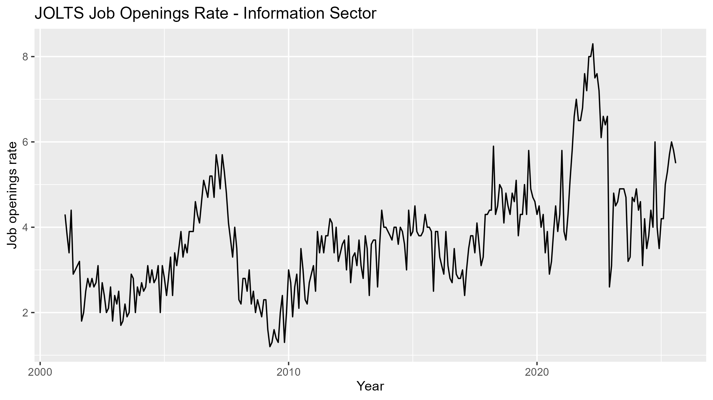
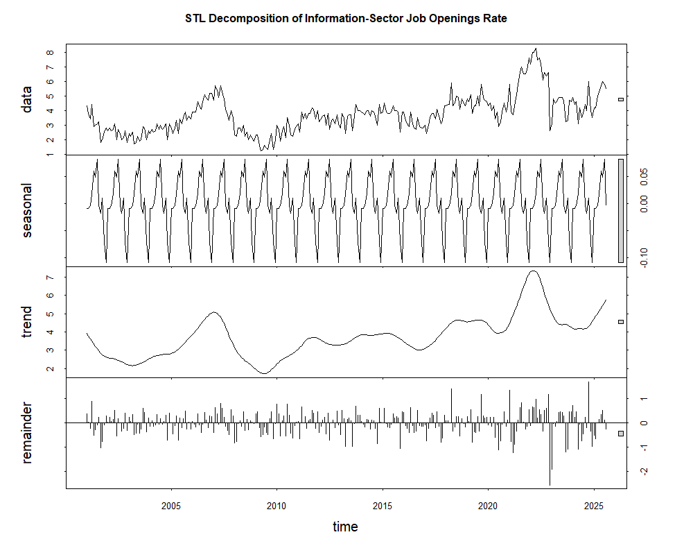
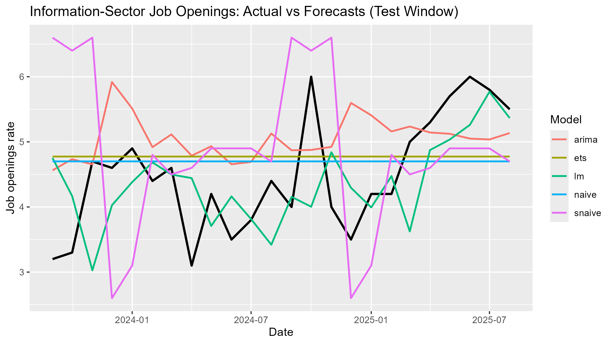

# Tech-Sector Job Openings Forecasting

Forecasting one-month-ahead job openings in the tech-adjacent Information sector using 24 years of public BLS labor market data, and testing whether simple time-series models can beat a naive baseline.

## The question

Can short-term momentum and seasonal patterns meaningfully improve one-month-ahead forecasts of the Information-sector job openings rate, compared to a naive "next month = this month" baseline?

## Data

- **Source:** U.S. Bureau of Labor Statistics, [Job Openings and Labor Turnover Survey (JOLTS)](https://www.bls.gov/jlt/)
- **Series:** Seasonally adjusted job openings rate, Information sector (NAICS 51) — used as a proxy for tech-adjacent hiring, since JOLTS has no dedicated "tech" category
- **Range:** January 2001 – August 2025 (296 monthly observations)
- **File:** `dataset.xlsx` (raw BLS export)

## Approach

1. Cleaned and reshaped the raw BLS export into a monthly time series (R, `readxl`)
2. Ran STL decomposition and ACF/PACF analysis to check for trend, seasonality, and momentum
3. Split the data into training (2001–Aug 2023) and a 24-month holdout test window (Sep 2023–Aug 2025)
4. Built and backtested 5 univariate forecasting models:
   - Naive (next month = this month)
   - Seasonal naive (this month = same month last year)
   - ARIMA(2,1,0)(1,0,2)[12]
   - ETS (exponential smoothing)
   - Lagged linear regression (previous 12 months + month-of-year dummies)
5. Evaluated all 5 on the same 24-month test window using MAE and MAPE

## Results

| Model | MAE | MAPE |
|---|---|---|
| Naive | 0.75 | 18.2% |
| Seasonal Naive | 1.28 | 31.7% |
| ARIMA | 0.88 | 21.9% |
| ETS | 0.78 | 19.1% |
| **Lagged Linear Regression** | **0.70** | **16.4%** |

The lagged linear regression — using the previous 12 months of openings rates plus month-of-year dummies — was the best performer, cutting forecast error by about **10%** relative to the naive baseline.

Notably, the more complex models (ARIMA, ETS) did **not** beat the naive baseline on this holdout window — a useful, honest finding that added model complexity doesn't automatically buy better short-term forecasts here, likely due to structural breaks (2008 recession, COVID) in the series.

*Information-sector job openings rate, 2001–2025, showing the 2008 downturn and the sharp post-pandemic spike.*

*Trend/seasonal/remainder decomposition — the trend component tracks major macroeconomic events closely.*

*All 5 models' forecasts vs. actual values over the 24-month test window.*

## Limitations

- The Information sector is a broad proxy for "tech" — it includes media and telecom alongside software/data roles
- Models are univariate and don't incorporate macro covariates (interest rates, GDP growth)
- Structural breaks (2008, 2020) make a single global model imperfect across the full history
- Only one-step-ahead forecasts were evaluated; multi-step forecasts might rank the models differently

## Files

- `assignment4.R` — full analysis script (data cleaning, EDA, all 5 models, evaluation)
- `dataset.xlsx` — raw BLS data
- `assignment4_metrics_table.csv` — model comparison results
- `writeup.docx` — full written report with methodology and discussion
- `figures/` — key charts referenced above

## Tools

R (`readxl`, `forecast`, `ggplot2`)
